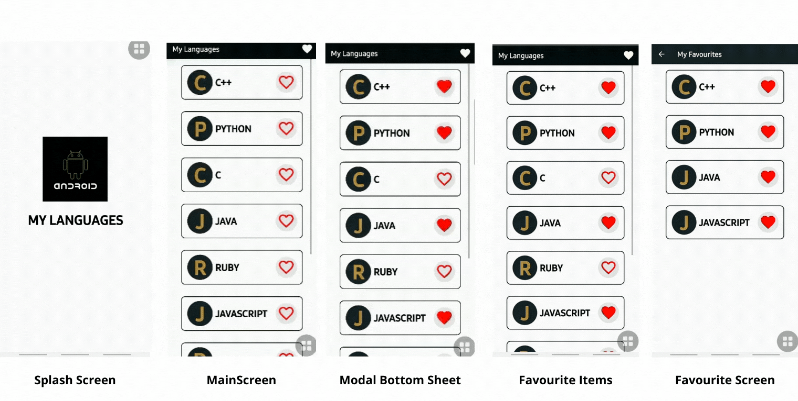

**Favourite Item App**
---
   + A starter app for those who want to kickstart their android development by learning.
   + This app shows a list of some programming languages which can be added or removed from your favourites list.
   + You will get a basic idea of
      + `Splash Screen`
      + [`Recycler View`](https://developer.android.com/reference/androidx/recyclerview/widget/RecyclerView) 
      + `Custom Page Transition`
      + `Bottom Sheet Dialog Fregmant`

**Screenshots**
---

**Prerequisites**
--- 
*To run the app you must have these:*
+ [`Android Studio`](https://developer.android.com/studio/) version 3.1 or later.
+ `Android SDK and other components`
+ `Configured Virtual Device/Android Phone`
